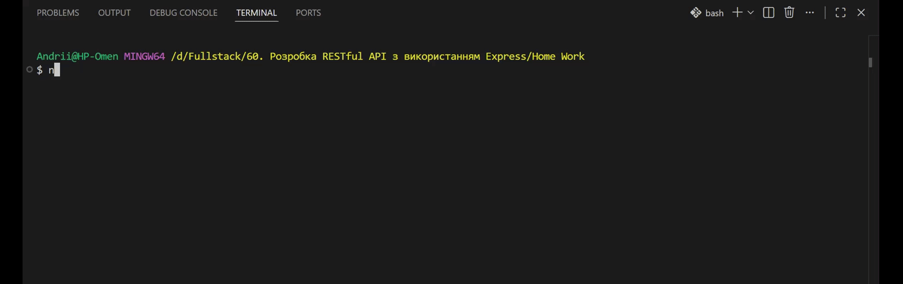

# 60. Розробка RESTful API з використанням Express

## Відео проєкту

## Опис проєкту

Цей проєкт є прикладом RESTful API, створеного за допомогою **Node.js**
та **Express** із використанням модульної структури.

Сервер реалізує базові CRUD-операції для двох ресурсів:

-   Users
-   Articles

Проєкт створено в навчальних цілях для відпрацювання:

-   маршрутизації в Express
-   розділення логіки на контролери
-   організації модульної структури
-   роботи з HTTP-методами (GET, POST, PUT, PATCH, DELETE)

Сервер запускається за адресою:

    http://localhost:3000

------------------------------------------------------------------------

## 📁 Структура проєкту

    project/
    │
    ├── app.mjs              # Точка входу, запуск сервера
    │
    ├── routes/
    │   ├── root.mjs           # Головний роутер
    │   ├── users.mjs          # Маршрути для користувачів
    │   └── articles.mjs       # Маршрути для статей
    │
    ├── controllers/
    │   ├── root.mjs           # Обробник кореневого маршруту
    │   ├── users.mjs          # Логіка роботи з користувачами
    │   └── articles.mjs       # Логіка роботи зі статтями
    │
    └── package.json

### Пояснення архітектури

-   **index.mjs** --- створює сервер і підключає головний роутер.
-   **routes/** --- відповідає за URL та HTTP-методи.
-   **controllers/** --- містить логіку обробки запитів.
-   Кожен модуль виконує одну чітко визначену функцію.

Це дозволяє: 
- легко масштабувати проєкт
- підтримувати чистоту коду
- уникати великих "монолітних" файлів

## Встановлення

### 1. Клонування репозиторію

    git clone <посилання-на-репозиторій>
    cd <назва-папки>

### 2. Встановлення залежностей

    npm install

## Запуск сервера

### Режим розробки (з nodemon)

    npm run dev

### Звичайний запуск

    node app.mjs

Після успішного запуску в консолі з'явиться:

    Server started on http://localhost:3000

# Доступні маршрути

## Кореневий маршрут

- GET     `/`        Перевірка роботи сервера

## Users

Базовий шлях: `/users`

- GET      `/users`       Отримати список користувачів
- POST     `/users`       Створити нового користувача
- GET      `/users/:id`   Отримати користувача за ID
- PUT      `/users/:id`   Повністю замінити користувача
- PATCH    `/users/:id`   Частково оновити користувача
- DELETE   `/users/:id`   Видалити користувача

## Articles

Базовий шлях: `/articles`

- GET      `/articles`       Отримати список статей
- POST     `/articles`       Створити нову статтю
- GET      `/articles/:id`   Отримати статтю за ID
- PUT      `/articles/:id`   Повністю замінити статтю
- PATCH    `/articles/:id`   Частково оновити статтю
- DELETE   `/articles/:id`   Видалити статтю

## Приклад тестування через Postman

### Отримати всіх користувачів:

    GET http://localhost:3000/users

### Отримати користувача з ID = 1:

    GET http://localhost:3000/users/1

### Створити користувача:

    POST http://localhost:3000/users

(тіло запиту можна додати у форматі JSON після підключення express.json())

## Використані технології

-   Node.js
-   Express
-   ES Modules (.mjs)
-   Nodemon
